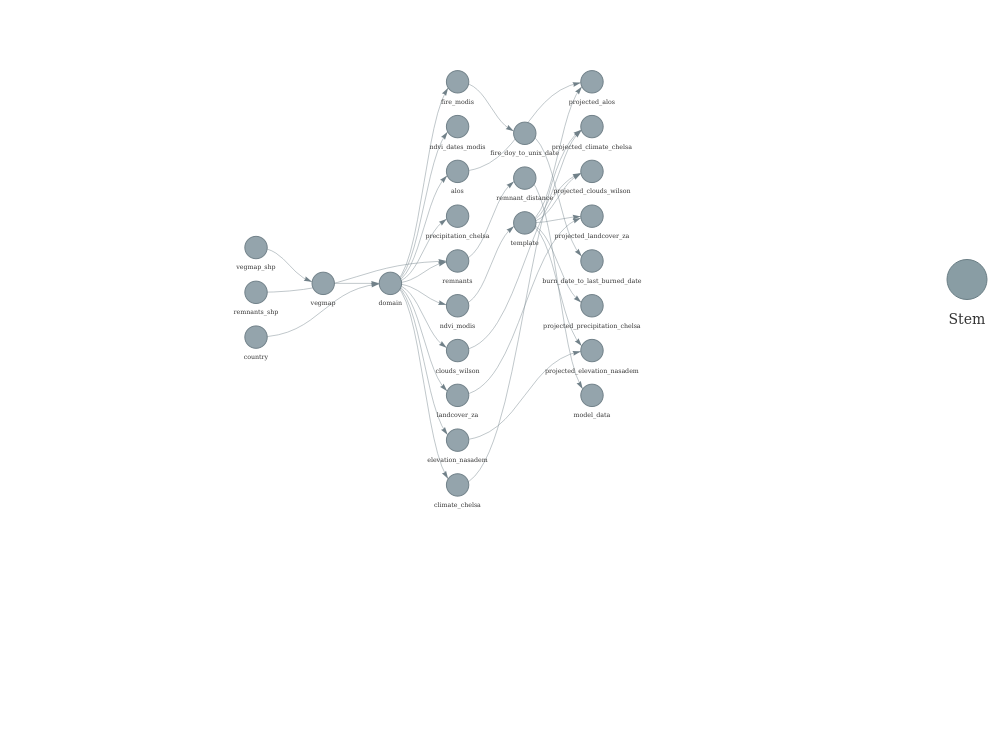

```{r setup}
library(tidyverse)
library(targets)
library(terra)
library(sf)
library(arrow)
library(jsonlite)
library(kableExtra)
library(lubridate)
library(visNetwork)
library(htmlwidgets)
library(viridis)
library(patchwork)

# Set options
knitr::opts_chunk$set(
  collapse = TRUE,
  comment = "#>",
  fig.path = "img/",
  dev = "png",
  dpi = 150
)
```


# Ecological Monitoring and Management Application (EMMA)

This repository processes environmental data for the [EMMA project](https://emma.io), assembling multi-sensor satellite and environmental datasets (MODIS, VIIRS, CHELSA, SoilGrids, etc.) for the Cape Floristic Region / South Africa. All data are domain-aligned to a 500m grid and distributed as Cloud-Optimized GeoTIFFs (COGs) and GeoParquet tables via GitHub Releases with full STAC catalog support.

## Pipeline Workflow

```{r pipeline-network, fig.width=12, fig.height=8}
# Generate and save pipeline network visualization
tar_visnetwork(
  targets_only = TRUE,
  label = c("time", "size", "branches")
) %>%
  htmlwidgets::saveWidget(file = "img/network.html", selfcontained = TRUE)

# Take screenshot
if (requireNamespace("webshot2", quietly = TRUE)) {
  webshot2::webshot("img/network.html", "img/network.png", vwidth = 1200, vheight = 800)
}
```



## Pipeline Health

```{r pipeline-health}
# Get pipeline metadata
meta <- tar_meta(fields = c(name, type, time, bytes, error, warnings))

# Calculate status
status_summary <- meta %>%
  mutate(
    status = case_when(
      error != "" ~ "errored",
      is.na(time) ~ "never run",
      TRUE ~ "up-to-date"
    )
  ) %>%
  count(status) %>%
  mutate(percent = round(100 * n / sum(n), 1))

# Display as table
kable(status_summary, 
      col.names = c("Status", "Count", "Percent (%)"),
      caption = "Pipeline Target Status Summary") %>%
  kable_styling(bootstrap_options = c("striped", "hover"))
```

[](https://github.com/eco-emma/emma_envdata/actions) **Last pipeline run:** `r max(meta$time, na.rm = TRUE)`

## Data Inventory

```{r data-inventory}
# Read STAC catalog to get temporal extents and asset counts
stac_base_url <- "https://github.com/eco-emma/emma_envdata/releases/download/stac"

# Function to safely read STAC JSON
read_stac <- function(path) {
  tryCatch(
    fromJSON(path, simplifyVector = FALSE),
    error = function(e) NULL
  )
}

# Get collection info
vi_coll <- read_stac("data/stac/vi/vi_collection.json")
burn_coll <- read_stac("data/stac/burn/burn_collection.json")
static_coll <- read_stac("data/stac/static/static_collection.json")

# Count items
vi_items <- length(list.files("data/stac/vi", pattern = "^vi_\\d{8}\\.json$"))
burn_modis_items <- length(list.files("data/stac/burn", pattern = "^burn_modis_\\d{6}\\.json$"))
burn_viirs_items <- length(list.files("data/stac/burn", pattern = "^burn_viirs_\\d{6}\\.json$"))

# Build inventory table
inventory <- tribble(
  ~Dataset, ~Source, ~Type, ~Format, ~`Release Tag`, ~`Time Steps`, ~`Date Updated`,
  "MODIS VI (Terra + Aqua)", "MOD13A1 + MYD13A1", "Dynamic", "COG GeoTIFF + Parquet", "vi_modis_raster", vi_items, 
    if(!is.null(vi_coll)) vi_coll$extent$temporal$interval[[1]][[2]] else NA,
  "VIIRS VI (S-NPP + NOAA-20)", "VNP13A1 + VJ113A1", "Dynamic", "COG GeoTIFF + Parquet", "vi_viirs_raster", vi_items,
    if(!is.null(vi_coll)) vi_coll$extent$temporal$interval[[1]][[2]] else NA,
  "MODIS Burned Area", "MCD64A1", "Dynamic", "COG GeoTIFF + Parquet", "burn_modis_raster", burn_modis_items,
    if(!is.null(burn_coll)) burn_coll$extent$temporal$interval[[1]][[2]] else NA,
  "VIIRS Burned Area", "VNP64A1", "Dynamic", "COG GeoTIFF + Parquet", "burn_viirs_raster", burn_viirs_items,
    if(!is.null(burn_coll)) burn_coll$extent$temporal$interval[[1]][[2]] else NA,
  "Fire History (derived)", "Multi-sensor merge", "Dynamic", "COG GeoTIFF", "firehistory_dynamic", 1,
    format(Sys.Date(), "%Y-%m-%d"),
  "Domain Grid", "NVM2024 + RLE2021", "Static", "COG GeoTIFF + Parquet", "static_data", 1, 
    meta %>% filter(name == "domain.tif") %>% pull(time) %>% as.character(),
  "Vegetation Map", "NVM2024", "Static", "COG GeoTIFF", "static_data", 1,
    meta %>% filter(name == "vegmap.tif") %>% pull(time) %>% as.character(),
  "Elevation", "NASADEM", "Static", "COG GeoTIFF", "static_data", 1,
    meta %>% filter(name == "elevation.tif") %>% pull(time) %>% as.character(),
  "Climate", "CHELSA BIO1-19", "Static", "GeoTIFF (19 layers)", "static_data", 19,
    meta %>% filter(name == "climate_chelsa") %>% pull(time) %>% as.character(),
  "Cloud Frequency", "MODCF (EarthEnv)", "Static", "COG GeoTIFF", "static_data", 1,
    meta %>% filter(name == "clouds.tif") %>% pull(time) %>% as.character(),
  "Soil Properties", "SoilGrids v2", "Static", "COG GeoTIFF", "static_data", 1,
    meta %>% filter(name == "soils.tif") %>% pull(time) %>% as.character(),
  "Topographic Diversity", "Derived from NASADEM", "Static", "COG GeoTIFF", "static_data", 1,
    meta %>% filter(name == "geodiversity.tif") %>% pull(time) %>% as.character()
)

kable(inventory, 
      caption = "EMMA Environmental Data Inventory") %>%
  kable_styling(bootstrap_options = c("striped", "hover", "condensed")) %>%
  column_spec(1, bold = TRUE) %>%
  row_spec(which(inventory$Type == "Dynamic"), background = "#f0f8ff")
```

## Temporal Coverage

```{r temporal-coverage, fig.width=10, fig.height=4}
# Build temporal coverage data
temporal_data <- tribble(
  ~Dataset, ~Start, ~End,
  "MODIS VI", "2026-03-01", "2026-05-31",
  "VIIRS VI", "2026-03-01", "2026-05-31",
  "MODIS Burn", "2026-03-01", "2026-05-31",
  "VIIRS Burn", "2026-03-01", "2026-05-31"
) %>%
  mutate(
    Start = as.Date(Start),
    End = as.Date(End)
  )

# Create gantt-style plot
ggplot(temporal_data, aes(y = Dataset)) +
  geom_segment(aes(x = Start, xend = End, yend = Dataset), 
               size = 8, color = "#4575b4") +
  geom_point(aes(x = Start), size = 3, color = "#313695") +
  geom_point(aes(x = End), size = 3, color = "#313695") +
  scale_x_date(date_labels = "%Y-%m", date_breaks = "1 month") +
  labs(
    title = "Temporal Coverage of Dynamic Datasets",
    x = "Date",
    y = NULL
  ) +
  theme_minimal(base_size = 12) +
  theme(
    panel.grid.minor = element_blank(),
    plot.title = element_font(face = "bold")
  )
```

## Domain Statistics

```{r domain-stats}
# Read domain info
domain_parquet <- "data/target_outputs/domain.parquet"
if (file.exists(domain_parquet)) {
  domain_df <- read_parquet(domain_parquet)
  
  domain_stats <- tribble(
    ~Metric, ~Value,
    "Total Pixels", format(nrow(domain_df), big.mark = ","),
    "Spatial Extent", "17°E to 33°E, 28°S to 35°S",
    "CRS", "EPSG:4326 (WGS84)",
    "Resolution", "500m",
    "Domain Area (km²)", format(round(nrow(domain_df) * 0.25, 0), big.mark = ",")
  )
  
  kable(domain_stats, col.names = c("", "")) %>%
    kable_styling(bootstrap_options = "striped", full_width = FALSE)
}
```

## Data Visualizations

### Most Recent Enhanced Vegetation Index (EVI)

```{r evi-map, fig.width=10, fig.height=6}
# Get most recent VI from STAC
vi_items <- list.files("data/stac/vi", pattern = "^vi_\\d{8}\\.json$", full.names = TRUE)
if (length(vi_items) > 0) {
  latest_vi <- read_stac(sort(vi_items, decreasing = TRUE)[1])
  
  # Get Terra EVI COG URL
  evi_url <- latest_vi$assets$modis_terra_vi$href
  
  # Read COG (using /vsicurl/ for remote access)
  evi_rast <- rast(paste0("/vsicurl/", evi_url))
  
  # Convert to data frame for plotting
  evi_df <- as.data.frame(evi_rast, xy = TRUE, na.rm = TRUE)
  names(evi_df)[3] <- "EVI"
  
  # Scale EVI (stored as integer x10000)
  evi_df <- evi_df %>%
    mutate(EVI = EVI / 10000)
  
  # Plot
  ggplot(evi_df, aes(x = x, y = y, fill = EVI)) +
    geom_raster() +
    scale_fill_viridis_c(option = "viridis", name = "EVI", 
                         limits = c(0, 1), na.value = "transparent") +
    coord_equal() +
    labs(
      title = paste("Enhanced Vegetation Index -", latest_vi$properties$datetime),
      subtitle = "MODIS Terra (MOD13A1.061) 16-day composite",
      x = "Longitude",
      y = "Latitude"
    ) +
    theme_dark(base_size = 14) +
    theme(
      panel.background = element_rect(fill = "#1a1a1a"),
      plot.background = element_rect(fill = "#1a1a1a"),
      text = element_text(color = "white"),
      axis.text = element_text(color = "gray80"),
      panel.grid = element_line(color = "gray30"),
      legend.background = element_rect(fill = "#1a1a1a"),
      legend.key = element_rect(fill = "#1a1a1a")
    )
}
```

### Time Since Fire

```{r fire-age-map, fig.width=10, fig.height=6}
# Get recentburn COG from STAC
recentburn_json <- read_stac("data/stac/burn/burn_recentburn.json")

if (!is.null(recentburn_json)) {
  fire_url <- recentburn_json$assets$recentburn$href
  
  # Read COG (band 1 = fire_age_days)
  fire_rast <- rast(paste0("/vsicurl/", fire_url))[[1]]
  
  # Convert to data frame
  fire_df <- as.data.frame(fire_rast, xy = TRUE, na.rm = TRUE)
  names(fire_df)[3] <- "fire_age_days"
  
  # Convert days to years
  fire_df <- fire_df %>%
    mutate(fire_age_years = fire_age_days / 365.25)
  
  # Plot
  ggplot(fire_df, aes(x = x, y = y, fill = fire_age_years)) +
    geom_raster() +
    scale_fill_viridis_c(option = "inferno", name = "Years\nSince Fire",
                         trans = "log1p", na.value = "transparent") +
    coord_equal() +
    labs(
      title = "Time Since Fire",
      subtitle = paste("Current as of", format(Sys.Date(), "%Y-%m-%d")),
      x = "Longitude",
      y = "Latitude"
    ) +
    theme_dark(base_size = 14) +
    theme(
      panel.background = element_rect(fill = "#1a1a1a"),
      plot.background = element_rect(fill = "#1a1a1a"),
      text = element_text(color = "white"),
      axis.text = element_text(color = "gray80"),
      panel.grid = element_line(color = "gray30"),
      legend.background = element_rect(fill = "#1a1a1a"),
      legend.key = element_rect(fill = "#1a1a1a")
    )
}
```

### Static Environmental Covariates

::: {layout-ncol=3}

```{r elevation-map, fig.width=4, fig.height=4}
# Read elevation COG
elev_json <- read_stac("data/stac/static/static_elevation.json")
if (!is.null(elev_json)) {
  elev_url <- elev_json$assets$elevation$href
  elev_rast <- rast(paste0("/vsicurl/", elev_url))
  
  elev_df <- as.data.frame(elev_rast, xy = TRUE, na.rm = TRUE)
  names(elev_df)[3] <- "elevation"
  
  ggplot(elev_df, aes(x = x, y = y, fill = elevation)) +
    geom_raster() +
    scale_fill_viridis_c(option = "mako", name = "m", na.value = "transparent") +
    coord_equal() +
    labs(title = "Elevation", x = NULL, y = NULL) +
    theme_dark(base_size = 10) +
    theme(
      panel.background = element_rect(fill = "#1a1a1a"),
      plot.background = element_rect(fill = "#1a1a1a"),
      text = element_text(color = "white"),
      axis.text = element_text(color = "gray80", size = 7),
      panel.grid = element_line(color = "gray30", size = 0.25),
      legend.background = element_rect(fill = "#1a1a1a"),
      legend.key.height = unit(0.4, "cm")
    )
}
```

```{r temp-map, fig.width=4, fig.height=4}
# Read BIO1 (mean annual temperature) from climate COG
bio1_url <- "https://github.com/eco-emma/emma_envdata/releases/download/static_data/CHELSA_bio01_1981-2010_V.2.1.tif"
bio1_rast <- rast(paste0("/vsicurl/", bio1_url))

bio1_df <- as.data.frame(bio1_rast, xy = TRUE, na.rm = TRUE)
names(bio1_df)[3] <- "temp"

# CHELSA BIO1 is in °C * 10
bio1_df <- bio1_df %>% mutate(temp = temp / 10)

ggplot(bio1_df, aes(x = x, y = y, fill = temp)) +
  geom_raster() +
  scale_fill_viridis_c(option = "plasma", name = "°C", na.value = "transparent") +
  coord_equal() +
  labs(title = "Mean Annual Temp", x = NULL, y = NULL) +
  theme_dark(base_size = 10) +
  theme(
    panel.background = element_rect(fill = "#1a1a1a"),
    plot.background = element_rect(fill = "#1a1a1a"),
    text = element_text(color = "white"),
    axis.text = element_text(color = "gray80", size = 7),
    panel.grid = element_line(color = "gray30", size = 0.25),
    legend.background = element_rect(fill = "#1a1a1a"),
    legend.key.height = unit(0.4, "cm")
  )
```

```{r precip-map, fig.width=4, fig.height=4}
# Read BIO12 (annual precipitation)
bio12_url <- "https://github.com/eco-emma/emma_envdata/releases/download/static_data/CHELSA_bio12_1981-2010_V.2.1.tif"
bio12_rast <- rast(paste0("/vsicurl/", bio12_url))

bio12_df <- as.data.frame(bio12_rast, xy = TRUE, na.rm = TRUE)
names(bio12_df)[3] <- "precip"

# CHELSA BIO12 is in kg m-2 year-1 (mm/year)
ggplot(bio12_df, aes(x = x, y = y, fill = precip)) +
  geom_raster() +
  scale_fill_viridis_c(option = "cividis", name = "mm", na.value = "transparent") +
  coord_equal() +
  labs(title = "Annual Precipitation", x = NULL, y = NULL) +
  theme_dark(base_size = 10) +
  theme(
    panel.background = element_rect(fill = "#1a1a1a"),
    plot.background = element_rect(fill = "#1a1a1a"),
    text = element_text(color = "white"),
    axis.text = element_text(color = "gray80", size = 7),
    panel.grid = element_line(color = "gray30", size = 0.25),
    legend.background = element_rect(fill = "#1a1a1a"),
    legend.key.height = unit(0.4, "cm")
  )
```

```{r soil-map, fig.width=4, fig.height=4}
# Read soil COG (first layer = SOC)
soil_json <- read_stac("data/stac/static/static_soil.json")
if (!is.null(soil_json)) {
  # Assuming soil.tif has SOC as first layer
  soil_url <- "https://github.com/eco-emma/emma_envdata/releases/download/static_data/soils.tif"
  soil_rast <- rast(paste0("/vsicurl/", soil_url))[[1]]  # Get first layer
  
  soil_df <- as.data.frame(soil_rast, xy = TRUE, na.rm = TRUE)
  names(soil_df)[3] <- "soil"
  
  ggplot(soil_df, aes(x = x, y = y, fill = soil)) +
    geom_raster() +
    scale_fill_viridis_c(option = "rocket", name = "", na.value = "transparent") +
    coord_equal() +
    labs(title = "Soil Organic Carbon", x = NULL, y = NULL) +
    theme_dark(base_size = 10) +
    theme(
      panel.background = element_rect(fill = "#1a1a1a"),
      plot.background = element_rect(fill = "#1a1a1a"),
      text = element_text(color = "white"),
      axis.text = element_text(color = "gray80", size = 7),
      panel.grid = element_line(color = "gray30", size = 0.25),
      legend.background = element_rect(fill = "#1a1a1a"),
      legend.key.height = unit(0.4, "cm")
    )
}
```

```{r clouds-map, fig.width=4, fig.height=4}
# Read clouds COG
clouds_json <- read_stac("data/stac/static/static_clouds.json")
if (!is.null(clouds_json)) {
  # Assuming first layer is mean annual cloud frequency
  clouds_url <- "https://github.com/eco-emma/emma_envdata/releases/download/static_data/clouds.tif"
  clouds_rast <- rast(paste0("/vsicurl/", clouds_url))[[1]]
  
  clouds_df <- as.data.frame(clouds_rast, xy = TRUE, na.rm = TRUE)
  names(clouds_df)[3] <- "clouds"
  
  ggplot(clouds_df, aes(x = x, y = y, fill = clouds)) +
    geom_raster() +
    scale_fill_viridis_c(option = "turbo", name = "%", na.value = "transparent") +
    coord_equal() +
    labs(title = "Cloud Frequency", x = NULL, y = NULL) +
    theme_dark(base_size = 10) +
    theme(
      panel.background = element_rect(fill = "#1a1a1a"),
      plot.background = element_rect(fill = "#1a1a1a"),
      text = element_text(color = "white"),
      axis.text = element_text(color = "gray80", size = 7),
      panel.grid = element_line(color = "gray30", size = 0.25),
      legend.background = element_rect(fill = "#1a1a1a"),
      legend.key.height = unit(0.4, "cm")
    )
}
```

```{r topo-map, fig.width=4, fig.height=4}
# Read topographic diversity COG
topo_json <- read_stac("data/stac/static/static_topography.json")
if (!is.null(topo_json)) {
  # Assuming first layer is topographic diversity index
  topo_url <- "https://github.com/eco-emma/emma_envdata/releases/download/static_data/geodiversity.tif"
  topo_rast <- rast(paste0("/vsicurl/", topo_url))[[1]]
  
  topo_df <- as.data.frame(topo_rast, xy = TRUE, na.rm = TRUE)
  names(topo_df)[3] <- "topo"
  
  ggplot(topo_df, aes(x = x, y = y, fill = topo)) +
    geom_raster() +
    scale_fill_viridis_c(option = "magma", name = "", na.value = "transparent") +
    coord_equal() +
    labs(title = "Topographic Diversity", x = NULL, y = NULL) +
    theme_dark(base_size = 10) +
    theme(
      panel.background = element_rect(fill = "#1a1a1a"),
      plot.background = element_rect(fill = "#1a1a1a"),
      text = element_text(color = "white"),
      axis.text = element_text(color = "gray80", size = 7),
      panel.grid = element_line(color = "gray30", size = 0.25),
      legend.background = element_rect(fill = "#1a1a1a"),
      legend.key.height = unit(0.4, "cm")
    )
}
```

:::

## STAC Catalog

All datasets are cataloged following the [SpatioTemporal Asset Catalog (STAC)](https://stacspec.org/) specification. The catalog is available at:

**🔗 [EMMA STAC Catalog](https://github.com/eco-emma/emma_envdata/releases/download/stac/catalog.json)**

### Accessing Data with `rstac`

```r
library(rstac)
library(arrow)

# Connect to STAC catalog
stac_url <- "https://github.com/eco-emma/emma_envdata/releases/download/stac"
catalog <- stac(paste0(stac_url, "/catalog.json"))

# Browse VI collection
vi_collection <- stac(paste0(stac_url, "/vi/vi_collection.json"))

# Search for specific date range
results <- stac_search(
  q = vi_collection,
  datetime = "2026-03-01/2026-05-31"
) %>%
  get_request()

# Access data from a specific item
item <- results$features[[1]]
terra_evi_url <- item$assets$modis_terra_vi$href

# Read the COG directly
library(terra)
evi_raster <- rast(paste0("/vsicurl/", terra_evi_url))

# Or read parquet files directly
parquet_url <- item$assets$data$href  # if available
df <- arrow::read_parquet(parquet_url)
```

## STAC Validation Status

```{r stac-validation}
# Read validation report
validation_file <- "data/stac/validation_report.json"
if (file.exists(validation_file)) {
  validation <- fromJSON(validation_file)
  
  validation_summary <- tribble(
    ~Metric, ~Value,
    "Total Links Checked", validation$summary$total_links,
    "Valid Links", validation$summary$valid_links,
    "Broken Links", validation$summary$broken_links,
    "Validation Status", if(validation$summary$broken_links == 0) "✅ PASS" else "❌ FAIL"
  )
  
  kable(validation_summary, col.names = c("", "")) %>%
    kable_styling(bootstrap_options = "striped", full_width = FALSE)
}
```

## GitHub Release Assets

```{r release-assets}
# Get release asset counts (read from manifest or tar_meta)
release_summary <- tribble(
  ~`Release Tag`, ~Description, ~`Asset Count`,
  "static_data", "Static environmental layers", "8+",
  "vi_modis_raster", "MODIS VI rasters", paste(vi_items, "composites × 2 sensors"),
  "vi_viirs_raster", "VIIRS VI rasters", paste(vi_items, "composites × 2 sensors"),
  "burn_modis_raster", "MODIS burned area rasters", paste(burn_modis_items, "months"),
  "burn_viirs_raster", "VIIRS burned area rasters", paste(burn_viirs_items, "months"),
  "firehistory_dynamic", "Fire history snapshot", "1",
  "stac", "STAC catalog + items", "50+"
)

kable(release_summary, 
      caption = "GitHub Release Summary") %>%
  kable_styling(bootstrap_options = c("striped", "hover"))
```

## Data Notes

- **MODIS/VIIRS EVI values**: Stored as `integer × 10000`. To restore: `EVI = value / 10000`
- **Fire dates**: Stored as days since 1970-01-01 (Unix epoch)
- **Time since fire**: Right-censored for pixels with no observed fire (age ≥ time since 2000-01-01)
- **Multi-sensor fire detection**: Priority order: CapeNature ground-truth > VIIRS (375m) > MODIS (500m)
- **Coordinate Reference System**: All rasters are in EPSG:4326 (WGS84) at 500m resolution
- **Cloud-Optimized GeoTIFFs**: All rasters use COG format for efficient cloud access via `/vsicurl/`

## Repository Structure

```
├── _targets.R          # Pipeline definition
├── R/                  # Processing functions
├── data/
│   ├── target_outputs/ # Processed data (local)
│   └── stac/          # STAC catalog JSONs
├── docs/              # Documentation
└── README.qmd         # This file (renders to README.md)
```

## Setup Instructions

### Required Packages

Install all dependencies:

```r
remotes::install_deps()
```

### Credentials

This pipeline requires:
- **NASA EarthData credentials** (for AppEEARS API): Set `EARTHDATA_USER` and `EARTHDATA_PASSWORD` environment variables
- **GitHub Personal Access Token** (for release uploads): Use `gitcreds::gitcreds_set()`

### Running the Pipeline

```r
# Load targets
library(targets)

# View pipeline
tar_visnetwork()

# Run full pipeline
tar_make()

# Run specific targets
tar_make(c(domain.tif, elevation.tif))
```

## Citation

[](https://zenodo.org/badge/latestdoi/421127852)

## License

This project is licensed under the MIT License. See [LICENSE.md](LICENSE.md) for details.

Individual datasets retain their original licenses (CC-BY-4.0 for most satellite products).
